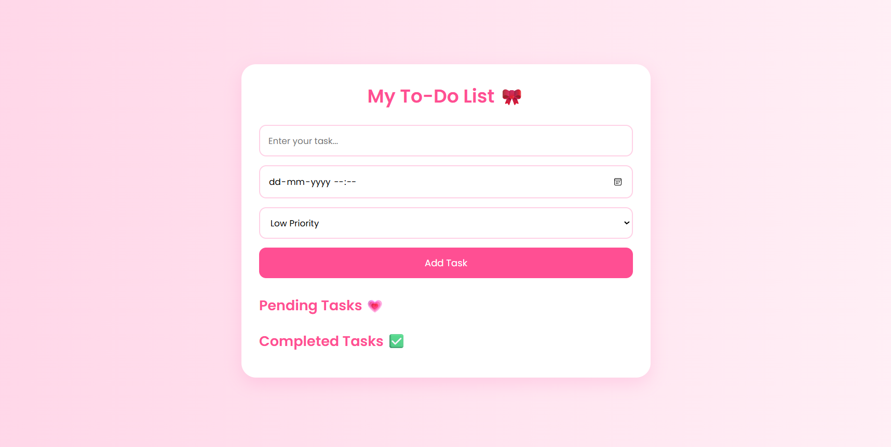
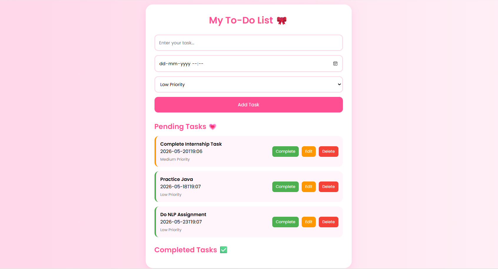
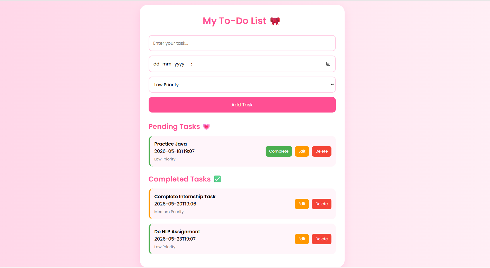

# To-Do Web App

A modern and aesthetic To-Do Web Application developed using HTML, CSS, and JavaScript.  
This project helps users manage their daily tasks with a clean and responsive interface.

## Features :

- Add Tasks
- Edit Tasks
- Delete Tasks
- Mark Tasks as Completed
- Local Storage Support
- Responsive Design
- Beautiful Pink Aesthetic UI

## Technologies Used :

- HTML5
- CSS3
- JavaScript

## Screenshots :

### Home Page


### Tasks View


### Completed Tasks



## Project Structure :

```text
Task3_ToDoApp/
│── index.html
│── style.css
│── script.js
│── README.md
│
└── assets/
    ├── home.png
    ├── tasks.png
    ├── completed.png
```

## How to Run the Project :

1. Download or Clone the Repository
2. Open the project folder in VS Code
3. Open `index.html`
4. Run using Live Server

## Author :

**Harshada Sankpal**


## Internship :

Web Development and Designing Internship  
Oasis Infobyte