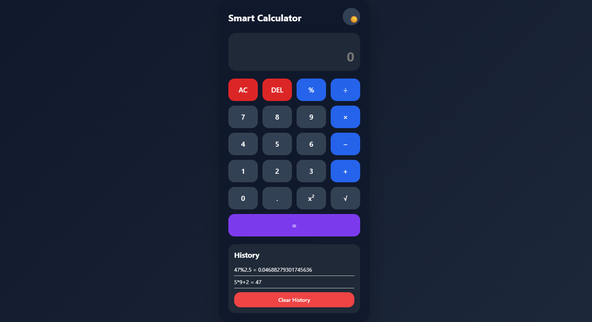
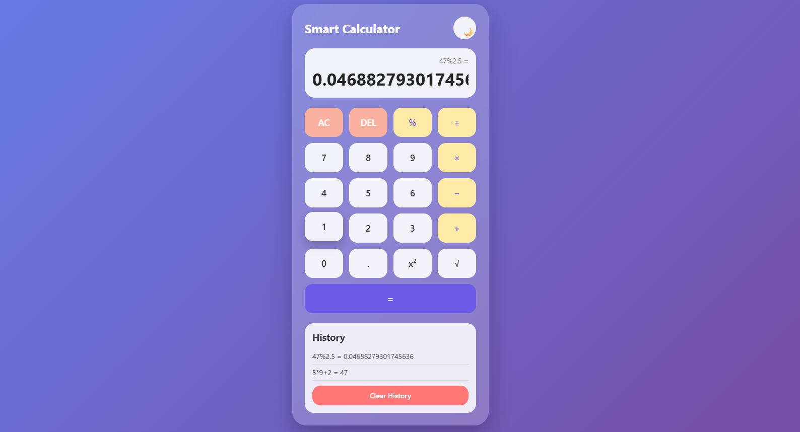

# Premium Smart Calculator

A modern and responsive Smart Calculator developed using HTML, CSS, and JavaScript.

This calculator provides advanced features like dark mode, keyboard support, scientific operations, and calculation history with a beautiful glassmorphism UI.

## Features

-  Basic Arithmetic Operations
-  AC (Clear All)
-  DEL Button
-  Dark / Light Mode
-  Keyboard Support
-  Calculation History
-  Percentage Calculation
-  Square Function (x²)
-  Square Root Function
-  Error Handling
-  Responsive Design
-  Smooth Hover Animations
-  Modern Glassmorphism UI

## Technologies Used

- HTML5
- CSS3
- JavaScript

## Screenshots

### Home Page

### Dark Mode

### Calculation History

##  Project Structure

Task1_Calculator/
│── index.html
│── style.css
│── script.js
│── README.md
│
└── assets/
    ├── home.png
    ├── darkmode.png
    └── history.png

## How to Run the Project

1. Download or Clone the Repository
2. Open the project folder in VS Code
3. Open `index.html`
4. Run using Live Server

## Project Objective

The objective of this project is to build a modern calculator application with interactive UI, scientific functionalities, and responsive frontend design using JavaScript.

## Author

**Harshada Sankpal**

## Internship

Web Development and Designing Internship  
Oasis Infobyte