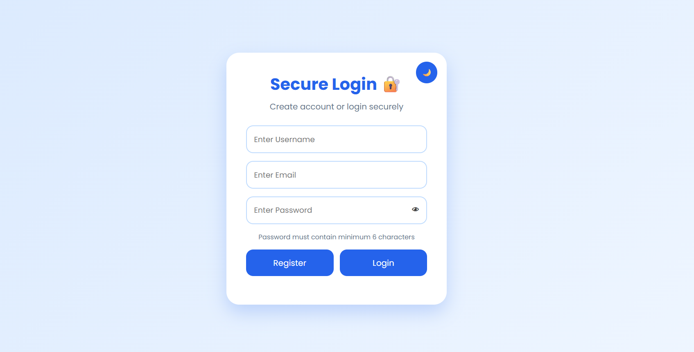
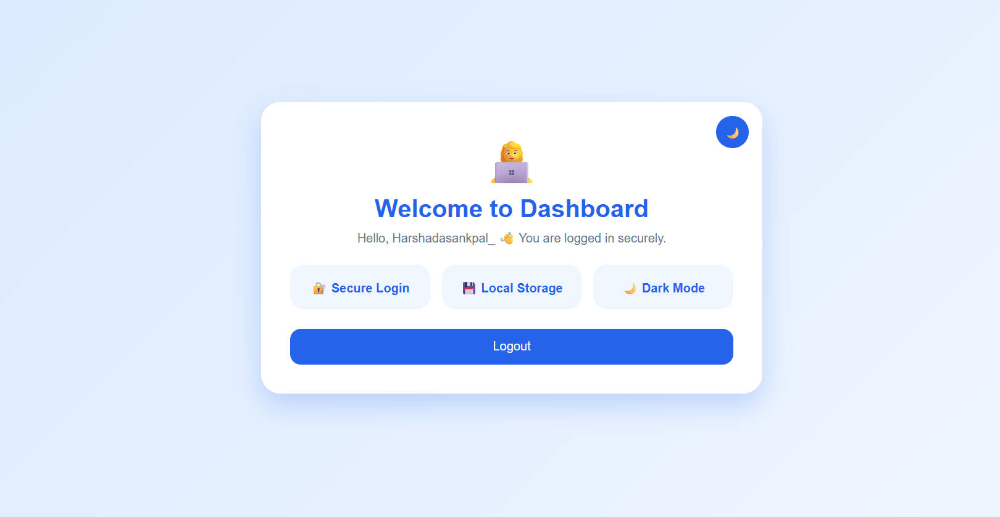

# Login Authentication System

A modern and responsive Login Authentication System developed using HTML, CSS, and JavaScript.

This project allows users to register, login securely, access a protected dashboard, and experience modern UI features like dark mode and password visibility toggle.

## Features

- User Registration & Login
- Email Validation
- Show / Hide Password
- Password Validation
- User Already Exists Check
- Dark / Light Theme Toggle
- Local Storage Authentication
- Responsive Modern UI
- Smooth Animations
- Secure Dashboard Page
- Logout Functionality

## Technologies Used

- HTML5
- CSS3
- JavaScript

## Screenshots

### Login Page


### Password Visibility Feature


### Successful Authentication


### Dark Mode


### Dashboard


## Project Structure

```text
Task4_LoginAuthentication/
│── index.html
│── style.css
│── script.js
│── dashboard.html
│── README.md
│
└── assets/
    ├── login.png
    ├── password.png
    ├── success.png
    ├── darkmode.png
    └── dashboard.png

## How to Run the Project

1. Download or Clone the Repository
2. Open the project folder in VS Code
3. Open `index.html`
4. Run using Live Server

## Project Objective

The objective of this project is to understand frontend authentication concepts, form validation, local storage handling, and responsive UI development using JavaScript.


## Author

**Harshada Sankpal**


## Internship

Web Development and Designing Internship  
Oasis Infobyte